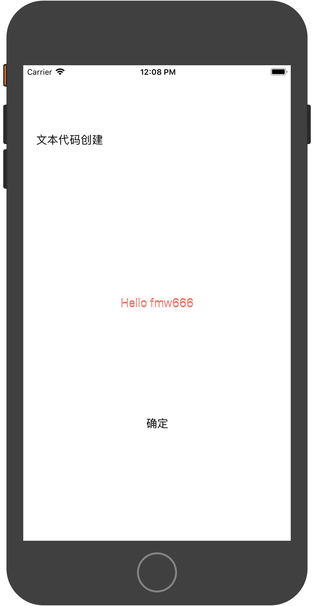
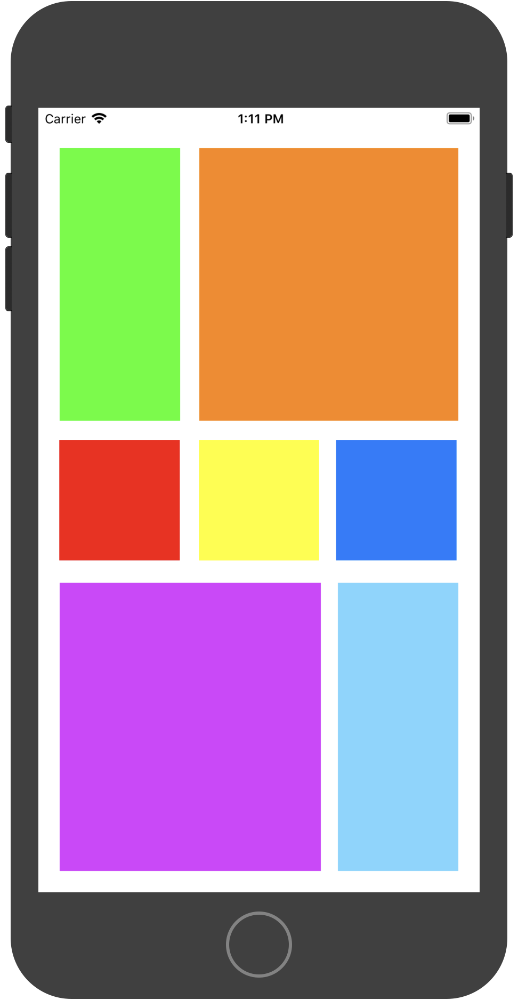
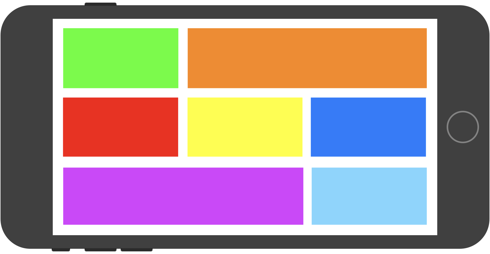
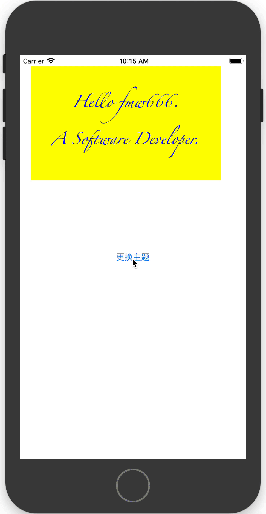
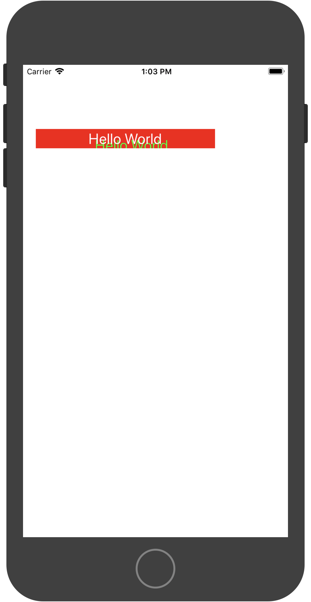

# 📖 iOS 项目

> 本仓库主要存储一些 iOS 基础组件使用的 [demo 项目](#welcome)。由于开发基于 [swift 语言](#welcome)，所以会有 swift 语言的基本语法示例。如果其中某个项目对您受益，欢迎 star～✨

    <h4>➡ <a href="#ios-demo项目"> iOS demo项目</a></h4>
    <h4>➡ <a href="#swift-语言"> Swift 语言</a></h4>

## iOS demo项目

&emsp;&emsp;⚡ ***提前声明：*** 所有项目基于 [Xcode 10.*](#welcome)，模拟器 [iphone 8 plus](#welcome).

+ #### [Hello World](/proj/Hello%20World)

    + 

        
点击展开程序运行图

        <ul>
             
            
        </ul>
    

    + Main.storyboard 布局
    
    + Library 控件使用

    + Library 控件的 Attributes inpector 字体处理、颜色处理
    
+ #### [自动布局](/proj/Auto%20Layout)

    + 

        
点击展开程序运行图

        <ul>
             
            
            
        </ul>
    

    + Main.storyboard 布局
    
    + Library 控件使用

    + Library 控件的 Attributes inpector 颜色处理

    + Library 控件的自动布局

+ #### [更换主题](/proj/Change%20Theme)

    + 

        
点击展开程序运行图

        <ul>
             
            
        </ul>
    

    + Main.storyboard 布局
    
    + Library 控件使用
    
    + Assistant editor 辅助编辑区域使用
    
    + 点击按钮事件
    
    + 随机函数
   
+ #### [UILabel 属性](/proj/UILabel)

    + 

        
点击展开程序运行图

        <ul>
             
            
        </ul>
    

    + ViewController.swift 编写
    
    + UILabel 组件
    
    + 修改 UILabel 属性：文本内容、字体和字号、字体颜色、对齐模式、引用颜色、阴影偏移量、断行模式
    
+ #### [动画处理](/01_SwiftPrimary#swift-语言基础)

    + 

        
点击展开程序运行图

        <ul>
        
        </ul>
    

    + Main.storyboard 布局

    + 字体处理、边距处理、字体颜色处理、按钮按下处理

+ #### [腾讯新闻页]()

    + 

        
点击展开程序运行图

        <ul>
        
        </ul>
    

    + Main.storyboard 布局

    + 字体处理、边距处理、字体颜色处理、按钮按下处理

+ #### [跟踪导弹](/proj/Track%20Bullet)

    + 

        
点击展开程序运行图

        <ul>
        
        </ul>
    

    + ViewController.swift

    + 图片（imageView）添加点击事件（UITapGestureRecognizer）

    + 图片（imageView）添加拖动事件（UIPanGestureRecognizer）

    + iOS模仿物理环境：吸附行为（UISnapBehavior）、碰撞行为（UICollisionBehavior）

    + 待实现功能：点击目标后导弹出现在坦克口，自动旋转一定时长直到朝向目标的中心位置，导弹头沿着直线发射

+ #### [导航栏](/proj/Navigation%20Controller)

    + 

        
点击展开程序运行图

        <ul>
             
            
        </ul>
    

    + 多 MVC 程序设计
    
    + 导航页面
    
    + 导航跳转
    
    + AppDelegate.swift
    
    + Cocoa Touch Class 之 UIViewController 视图建立
    
+ #### [底部标签栏](/proj/TabBar%20Controller)

    + 

        
点击展开程序运行图

        <ul>
             
            
        </ul>
    

    + 多 MVC 程序设计
    
    + 标签栏页面
    
    + 标签栏跳转
    
    + AppDelegate.swift
    
    + Cocoa Touch Class 之 UIViewController 视图建立
    
    + #### [多MVC参数传递](/proj/Transfer%20Parameter)
    
    + 

    
点击展开程序运行图

    <ul>
     
    
    </ul>
    

    
    + 多 MVC 程序设计
    
    + 导航页面
    
    + 导航跳转
    
    + AppDelegate.swift
    
    + Cocoa Touch Class 之 UIViewController 视图建立
    
    + 不同页面间参数传递
    

    <a href="#-ios-项目">back to top ⬆</a>

## Swift 语言

    <h3>「 语法及基本数据类型 」</h3>

+ #### [语法基础](/docs/01_SwiftPrimary#swift-语言基础)

  + 定义变量、常量
  
  + 输出打印及输出转义
  
  + 类型别名、“可选”实例
  
  + “运算符”实例
  
  + 元组
  
  + 数组
  
  + 字典

+ #### [函数](/docs/01_SwiftPrimary#函数)

  + 函数定义
  
  + 标签使用
  
  + 函数嵌套
  
  + 函数作为参数、返回值传递

+ #### [代码实例：回文数判断](/docs/01_SwiftPrimary#回文素数判断)

    <h3>「 Swift 面向对象编程 」</h3>

+ #### [枚举和结构体](/docs/02_SwiftOOP#枚举和结构体)

  + 枚举定义

  + 结构体定义

+ #### [类和对象](/docs/02_SwiftOOP#类和对象)

  + 类的创建

  + 类的实例创建

  + 继承

  + 便利初始化器

+ #### [扩展](/docs/02_SwiftOOP#扩展)

    + 扩展计算属性

    + 扩展方法

    + 扩展下标

    + 扩展构造函数

+ #### [协议](/docs/02_SwiftOOP#协议)

    + 协议的定义

    + 协议的使用

+ #### [泛型](/docs/02_SwiftOOP#泛型)

    + 模板函数

    + 模板类

+ #### [面向对象的综合应用](/docs/02_SwiftOOP#综合应用)

    <a href="#-ios-项目">back to top ⬆</a>

 

    --完--

