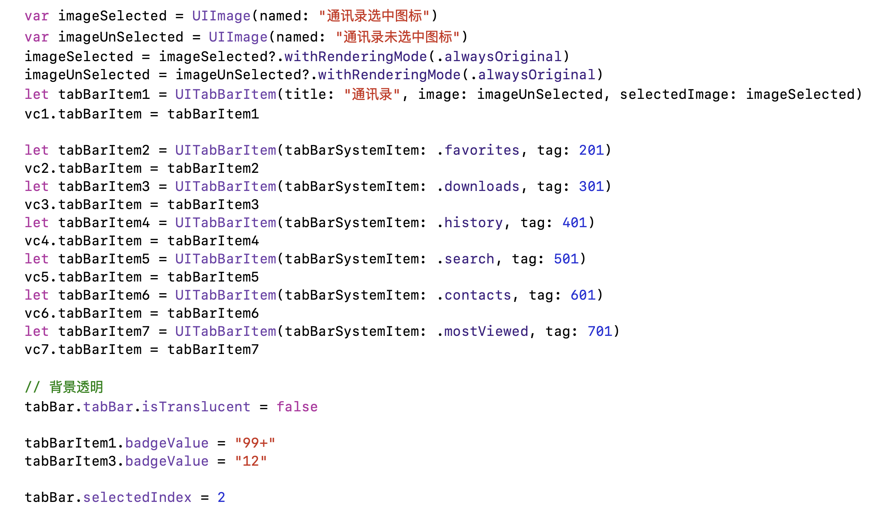

# 📱 iOS 项目

> 本仓库主要存储一些 iOS 基础组件使用的 [demo 项目](#welcome)。由于开发基于 [swift 语言](#welcome)，所以会有 swift 语言的基本语法示例。如果其中某个项目对您受益，欢迎 star～✨

    <h4>➡ <a href="#ios-demo项目"> iOS demo项目</a></h4>
    <h4>➡ <a href="#swift-语言"> Swift 语言</a></h4>

## iOS demo项目

&emsp;&emsp;⚡ ***提前声明：*** 所有项目基于 [Xcode 10.*](#welcome) 编辑器，模拟器基于 [iphone 8 plus](#welcome).

&emsp;<i><b>——</b></i>

+ #### [Hello World](/proj/Hello%20World)

    

        

            
程序运行效果

            <ul>
                 
                
            </ul>
        

        

            
程序核心代码

            <ul>
                 
                
            </ul>
        

    

    + Main.storyboard 布局

    + Library 控件使用

    + Library 控件的 Attributes inpector 字体处理、颜色处理

&emsp;<i><b>——</b></i>

+ #### [自动布局](/proj/Auto%20Layout)

    

        

            
程序运行效果

            <ul>
                 
                
                
            </ul>
        

        

            
<s>程序核心代码</s>

        

    

    + Main.storyboard 布局
    
    + Library 控件使用

    + Library 控件的 Attributes inpector 颜色处理

    + Library 控件的自动布局

&emsp;<i><b>——</b></i>

+ #### [按钮响应文本框](/proj/TextField)

    

        

            
程序运行效果

            <ul>
                 
                
            </ul>
        

        

            
程序核心代码

            <ul>
                 
                
            </ul>
        

    

    + Main.storyboard 布局
    
    + UITextField 文本框控件

    + UILabel 标签控件

&emsp;<i><b>——</b></i>

+ #### [更换主题](/proj/Change%20Theme)

    

        

            
程序运行效果

            <ul>
                 
                
            </ul>
        

        

            
程序核心代码

            <ul>
                 
                
            </ul>
        

    

    + Main.storyboard 布局
    
    + Library 控件使用
    
    + Assistant editor 辅助编辑区域使用
    
    + 点击按钮事件
    
    + 随机函数
   
&emsp;<i><b>——</b></i>

+ #### [UILabel 属性](/proj/UILabel)

    

        

            
程序运行效果

            <ul>
                 
                
            </ul>
        

        

            
程序核心代码

            <ul>
                 
                
            </ul>
        

    

    + ViewController.swift 编写
    
    + UILabel 组件
    
    + 修改 UILabel 属性：文本内容、字体和字号、字体颜色、对齐模式、引用颜色、阴影偏移量、断行模式

&emsp;<i><b>——</b></i>

+ #### [弹出可选框](/proj/Alert)

    

        

            
程序运行效果

            <ul>
                 
                
            </ul>
        

        

            
程序核心代码

            <ul>
                 
                
            </ul>
        

    

    + ViewController.swift 编写
    
    + UIAlertController 提醒框控制器

    + UIAlertAction 提醒动作

&emsp;<i><b>——</b></i>

+ #### [启动动画 及 头像选择](/proj/image)

    

        

            
程序运行效果

            <ul>
                 
                
            </ul>
        

        

            
程序核心代码

            <ul>
                 
                
            </ul>
        

    

    + ViewController.swift 编写

    + 线程休眠，显示启动图片
    
    + 图片选择器（UIImagePickerController）

&emsp;<i><b>——</b></i>

+ #### [屏幕视图](/proj/ViewForm)

    

        

            
程序运行效果

            <ul>
                 
                
            </ul>
        

        

            
程序核心代码

            <ul>
                 
                
            </ul>
        

    

    + ViewController.swift 编写
    
    + arc4random 随机数生成
    
&emsp;<i><b>——</b></i>

+ #### [动画处理](/proj/Sleep)

    

        

            
程序运行效果

            <ul>
                 
                
            </ul>
        

        

            
程序核心代码

            <ul>
                 
                
            </ul>
        

    

    + ViewController.swift 编写

    + animate 动画效果处理
    
    + arc4random 随机数生成
    
&emsp;<i><b>——</b></i>

+ #### [添加按钮 的视图动画](/proj/Pop%20Animate)

    

        

            
程序运行效果

            <ul>
                 
                
            </ul>
        

        

            
程序核心代码

            <ul>
                 
                
            </ul>
        

    

    + ViewController.swift 编写

    + animate 动画效果处理
    
    + 图片翻转

&emsp;<i><b>——</b></i>

+ #### [下拉收回 的视图动画](/proj/Login%20Animate)

    

        

            
程序运行效果

            <ul>
                 
                
            </ul>
        

        

            
程序核心代码

            <ul>
                 
                
            </ul>
        

    

    + ViewController.swift 编写

    + animate 动画效果处理
    
    + 图片弹出收回

&emsp;<i><b>——</b></i>

+ #### [选择器](/proj/Picker)

    

        

            
程序运行效果

            <ul>
                 
                
            </ul>
        

        

            
程序核心代码

            <ul>
                 
                
            </ul>
        

    

    + ViewController.swift 编写

    + UIPickerView 选择器
    
    + UIToolbar 工具栏
    
&emsp;<i><b>——</b></i>

+ #### [常用 UIKit 组件](/proj/General%20UIKit)

    

        

            
程序运行效果

            <ul>
                 
                
            </ul>
        

        

            
程序核心代码

            <ul>
                 
                
            </ul>
        

    

    + ViewController.swift 编写

    + UIPickerView 选择器
    
    + UITextField 属性设置
    
    + UISwitch 组件
    
    + UITextView 组件

&emsp;<i><b>——</b></i>

+ #### [通讯录式单元格表格](/proj/TableView)

    

        

            
程序运行效果

            <ul>
                 
                
            </ul>
        

        

            
程序核心代码

            <ul>
                 
                
            </ul>
        

    

    + ViewController.swift 编写

    + UITableView 控件

&emsp;<i><b>——</b></i>

+ #### [美团商家列表](/proj/CustomView)

    

        

            
程序运行效果

            <ul>
                 
                
            </ul>
        

        

            
程序核心代码

            <ul>
                 
                
            </ul>
        

    

    + ViewController.swift 编写

    + UITableView 控件

&emsp;<i><b>——</b></i>

+ #### [腾讯新闻页](/proj/Tencent%20News)

    

        

            
程序运行效果

            <ul>
                 
                
            </ul>
        

        

            
程序核心代码

            <ul>
                 
                
            </ul>
        

    

    + ViewController.swift 编写

    + UITableView 控件

&emsp;<i><b>——</b></i>

+ #### [重力下落行为](/proj/Fall%20Down)

    

        

            
程序运行效果

            <ul>
                 
                
            </ul>
        

        

            
程序核心代码

            <ul>
                 
                
            </ul>
        

    

    + iOS模仿物理环境：重力行为（UIGravityBehavior）、碰撞行为（UICollisionBehavior）

    + 分段选择控件（UISegmentedControl）
    
&emsp;<i><b>——</b></i>

+ #### [跟踪导弹](/proj/Track%20Bullet)

    

        

            
程序运行效果

            <ul>
                 
                
            </ul>
        

        

            
程序核心代码

            <ul>
                 
                
            </ul>
        

    

    + ViewController.swift

    + 图片（imageView）添加点击事件（UITapGestureRecognizer）

    + 图片（imageView）添加拖动事件（UIPanGestureRecognizer）

    + iOS模仿物理环境：吸附行为（UISnapBehavior）、碰撞行为（UICollisionBehavior）

    + 待实现功能：点击目标后导弹出现在坦克口，自动旋转一定时长直到朝向目标的中心位置，导弹头沿着直线发射

&emsp;<i><b>——</b></i>

+ #### [导航栏](/proj/Navigation%20Controller)

    

        

            
程序运行效果

            <ul>
                 
                
            </ul>
        

        

            
程序核心代码

            <ul>
                 
                
            </ul>
        

    

    
    + 多 MVC 程序设计
    
    + 导航页面
    
    + 导航跳转
    
    + AppDelegate.swift
    
    + Cocoa Touch Class 之 UIViewController 视图建立

&emsp;<i><b>——</b></i>

+ #### [底部标签栏](/proj/TabBar%20Controller)

    

        

            
程序运行效果

            <ul>
                 
                
            </ul>
        

        

            
程序核心代码

            <ul>
                 
                
            </ul>
        

    

    + 多 MVC 程序设计
    
    + 标签栏页面
    
    + 标签栏跳转
    
    + AppDelegate.swift
    
    + Cocoa Touch Class 之 UIViewController 视图建立

&emsp;<i><b>——</b></i>

+ #### [多MVC参数传递](/proj/Transfer%20Parameter)
    
    

        

            
程序运行效果

            <ul>
                 
                
            </ul>
        

        

            
程序核心代码

            <ul>
                 
                
            </ul>
        

    

    
    + 多 MVC 程序设计
    
    + 导航页面
    
    + 导航跳转
    
    + AppDelegate.swift
    
    + Cocoa Touch Class 之 UIViewController 视图建立
    
    + 不同页面间参数传递

&emsp;<i><b>——</b></i>

+ #### [通讯录](/proj/Contacts)
    
    

        

            
程序运行效果

            <ul>
                 
                
            </ul>
        

        

            
程序核心代码

            <ul>
                 
                
            </ul>
        

    

    
    + 多 MVC 程序设计应用
    
    + 导航页面
    
    + 导航跳转
    
    + AppDelegate.swift
    
    + tableView 单元格创建
    
    + 不同页面间参数传递
    
&emsp;<i><b>——</b></i>

+ #### [微信 APP demo](/proj/WeChat%20App)
    
    

        

            
程序运行效果

            <ul>
                 
                
            </ul>
        

        

            
程序核心代码

            <ul>
                 
                
            </ul>
        

    

    
    + 多 MVC 程序设计应用
    
    + 导航页面
    
    + 导航跳转
    
    + UIBarButtonItem
    
    + statusBar
    
    + tableView 单元格创建
    
    + Info.plist、General 属性修改
    
    + ...
    

    <a href="#-ios-项目">back to top ⬆</a>

## Swift 语言

    <h3>「 语法及基本数据类型 」</h3>

+ #### [语法基础](/docs/01_SwiftPrimary#swift-语言基础)

  + 定义变量、常量
  
  + 输出打印及输出转义
  
  + 类型别名、“可选”实例
  
  + “运算符”实例
  
  + 元组
  
  + 数组
  
  + 字典

+ #### [函数](/docs/01_SwiftPrimary#函数)

  + 函数定义
  
  + 标签使用
  
  + 函数嵌套
  
  + 函数作为参数、返回值传递

+ #### [代码实例：回文数判断](/docs/01_SwiftPrimary#回文素数判断)

    <h3>「 Swift 面向对象编程 」</h3>

+ #### [枚举和结构体](/docs/02_SwiftOOP#枚举和结构体)

  + 枚举定义

  + 结构体定义

+ #### [类和对象](/docs/02_SwiftOOP#类和对象)

  + 类的创建

  + 类的实例创建

  + 继承

  + 便利初始化器

+ #### [扩展](/docs/02_SwiftOOP#扩展)

    + 扩展计算属性

    + 扩展方法

    + 扩展下标

    + 扩展构造函数

+ #### [协议](/docs/02_SwiftOOP#协议)

    + 协议的定义

    + 协议的使用

+ #### [泛型](/docs/02_SwiftOOP#泛型)

    + 模板函数

    + 模板类

+ #### [面向对象的综合应用](/docs/02_SwiftOOP#综合应用)

    <a href="#-ios-项目">back to top ⬆</a>

 

    --完--

